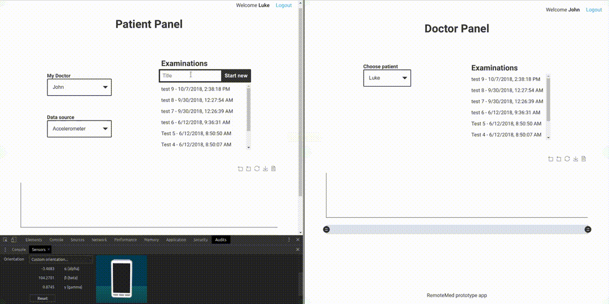

# RemoteMed

Prof of concept app for streaming and collecting data from patient,
sending the data to medical doctor and visualize it in real time
using Node.js, WebSocket and MongoDB.

## How it works

### Data flow during examination session

##### 1. Signal acquisition

Accelerometer data is acquired with sampling frequency of 20Hz. The samples are kept in buffer of length 1s. 

##### 2. Signal processing

When the buffer becomes full, the data is converted into a data packet. The package consists of the order number and individual sample values. Then the data is transformed into binary data, where the order number is saved at the beginning as int32, and after that the values from the table are kept as float32 (the array is flattened in the case of multidimensional data). The binarized data is then sent to the server.

##### 3. Getting active connection

Right after the data packet is received by server the app tries to find active connection with patient's doctor and sends data directly if it's available.

##### 4. Signal reconstruction

In parallel with sending the data directly to doctor browser it is also processed from binary format to multidimensional array and appended to database collection.

##### 5. Signal reconstruction

After receiving the data by the physician, the packet is processed to a readable format for the chart plotting library, thanks to the previously loaded information (sampling frequency, packet length, number of data dimensions, test start time) and the order number of the packet. The processed data is immediately displayed on the graph if the doctor is viewing the patient's examination at the time or saved to the buffer and loaded as soon as the examination is selected.

## License

RemoteMed is released under the terms of the MIT license. See LICENSE file for details.

## Credits

RemoteMed is developed by Rafael Pawlos, http://rafaelpawlos.com
